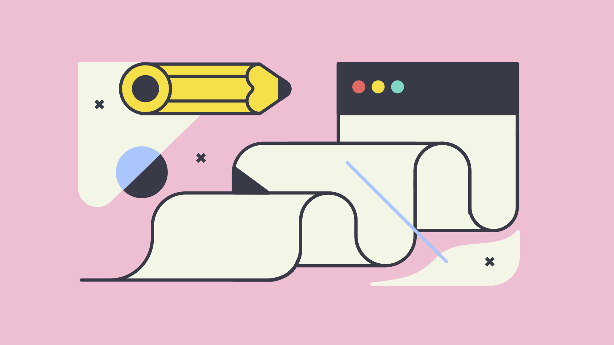

# design-heaven :angel::stars:

Introduction
------------
Stunning open source design resources every designer/developer should know! :ok_hand:

<a href="https://icons8.com/ouch">
  

    
  

</a>

Table of Contents
-----------------
1. [Stock Images](#stock-images)
2. [Stock Videos](#stock-videos)
3. [Icons](#icons)
4. [Fonts](#fonts)
5. [Illustrations](#illustrations)
6. [Design Systems](#design-systems)
7. [Design Inpiration](#design-inspiration)
8. [Colors](#colors)
9. [Prototyping Tools](#prototyping-tools)
10. [Animation Tools](#animation-tools)

Design Resources
----------------

### Stock Images

- **[Burst by Shopify](https://burst.shopify.com/)** - Download free, high-resolution images
- **[Pexels](https://www.pexels.com)** - Free stock photos you can use everywhere.
- **[Pixabay](https://pixabay.com/)** - Over 1.6 million royalty free stock photos and videos shared by our generous community.
- **[reshot](https://www.reshot.com/)** - Handpicked, non-stocky images. Yours to use as you wish.
- **[StockSnap](https://stocksnap.io/)** - High quality and high resolution stock images free from all copyright restrictions(CC0)
- **[Unsplash](https://unsplash.com/)** - Beautiful, free images and photos that you can download and use for any project.

### Stock Videos

- **[Coverr](https://coverr.co/)** - Download royalty free (for personal and commercial use), unique and beautiful video footage for your website or any project.
- **[Mixkit](https://mixkit.co/)** - Extraordinary HD videos for you to use, completely free of charge.
- **[Pexels Videos](https://www.pexels.com/videos/)** - The best free videos shared by the Pexels community.
- **[Videvo](https://www.videvo.net/)** - Free HD stock footage & motion graphics for any project!

### Icons

No end of beautiful **SVG** and **web font** icons that can be included to your next project :boom:

- **[Eva Icons](https://akveo.github.io/eva-icons/#/)** - Eva Icons is a pack of more than 480 beautifully crafted Open Source icons for common actions and items.   
- **[Feather icons](https://feathericons.com/)** - Feather is a collection of simply beautiful open source icons. Each icon is designed on a 24x24 grid with an emphasis on simplicity, consistency and readability.
- **[Font Awesome](https://fontawesome.com/)** - Get vector icons and social logos on your website with Font Awesome, the web's most popular icon set and toolkit.
- **[Icons8](https://icons8.com/icons)** - Get free icons designed to combine perfectly and fit into the style of your design.
- **[IconBros](https://www.iconbros.com/)** - 1227+ free icons grouped in 38 collections
- **[Ionicons](https://ionicons.com/)** - Premium designed icons for use in web, iOS, Android, and desktop apps. Support for SVG and web font. Completely open source, MIT licensed and built by the Ionic Framework team.
- **[Material Design icons](https://materialdesignicons.com/)** - Material Design Icons' growing icon collection allows designers and developers targeting various platforms to download icons in the format, color and size they need for any project.
- **[Οutlane](https://outlane.co/graphics/animated-svg-icons-pack/)** - The pack includes 100 hand-crafted animated vector icons that you can use on any website or app
- **[Prefect Icons](http://www.perfecticons.com/)** - Download Free Perfect Vector Icons
- **[The Noun Project](https://thenounproject.com/)** - Over 2 Million curated icons, created by a global community

### Fonts
 
Really, who doesn't love a great **typeface**?! :abc:

- **[1001FreeFonts](https://www.1001freefonts.com/)** - Download 41882 fonts in 21841 families for Windows, Mac and Linux. 1001 Free Fonts offers a huge selection of free fonts. New fonts are added daily.
- **[Aleo](https://www.behance.net/gallery/8018673/ALEO-Free-Font-Family)** - Free contemporary slab serif typeface
- **[Behance](https://www.behance.net/search?content=projects&sort=appreciations&time=week&search=free%20font)** - Behance is a network of sites and services specializing in self-promotion, including consulting, online portfolio sites and many free font resources. All you have to do is to add some clever search filters, such as 'free font'.
- **[Clear Sans](https://01.org/clear-SANS)** - Clear Sans has been recognized as a versatile OpenType font for screen, print, and Web.
- **[Cooper Hewitt](https://www.cooperhewitt.org/open-source-at-cooper-hewitt/cooper-hewitt-the-typeface-by-chester-jenkins/)** - The Typeface created by Chester Jenkins 
- **[Dafont](https://www.dafont.com/)** - Archive of freely downloadable fonts. Browse by alphabetical listing, by style, by author or by popularity.
- **[FontPair](https://fontpair.co/)** - Font Pair helps designers pair Google Fonts together. Beautiful Google Font combinations and pairs.
- **[FontSpark](https://fontspark.app/)** - Helping designers discover the perfect font for their next design project.
- **[FontSquirrel](https://www.fontsquirrel.com/)** - Font Squirrel scours the internet for high quality, legitimately free fonts . Download thousands of completely legal, high quality, free fonts.
- **[Google Fonts](https://fonts.google.com/)** - Google Fonts is a library of 900 libre licensed fonts, an interactive web directory for browsing the library, and APIs for conveniently using the fonts via CSS and Android.   
- **[Google Noto Font](https://www.google.com/get/noto/)** - Beautiful and free fonts for all languages

### Illustrations

- **[Absurb](https://absurd.design/)** - What about surrealist illustrations for landing pages? Take every user on an individual journey through their own imagination.
- **[Avataaars](https://getavataaars.com/)** - Mix and match avatar illustrations. Combine clothes, hair, emotions, accessories, and colors. 
- **[Blobmaker](https://www.blobmaker.app/)** - Create organic svg shapes in just a few seconds
- **[FreePik](https://www.freepik.com/)** - More than 3 millions free vectors, PSD, photos and free icons.
- **[Ηumaaans](https://www.humaaans.com/)** - Mix-&-match illustrations of people with a design library.
- **[Ouch](https://icons8.com/ouch)**( - Free illustrations to class up your project.
- **[Undraw](http://undraw.co/)** - Open-source illustrations for every project you can imagine and create.

### Design Systems

Popular must-known **design systems** that can speed up development :rocket:

- **[Ant Design](https://ant.design/)** by [Alibaba](https://www.alibaba.com/) - An enterprise-class UI design language and React implementation.
- **[Atlaskit](https://atlaskit.atlassian.com/)** by [Atlassian](https://atlassian.com/) - Atlassian's official UI library, built according to the Atlassian Design Guidelines.
- **[Audi Design](https://www.audi.com/ci/en/guides/user-interface/introduction.html)** by [Audi](https://www.audi.com/en.html) - Audi user interfaces are as varied as their uses – ranging from inspiring websites to applications for a particular service.
- **[Backpack](https://backpack.github.io/)** by [Skyscanner](https://www.skyscanner.net/) - Backpack is a collection of design resources, reusable components and guidelines for creating Skyscanner products.
- **[Grommet](https://v2.grommet.io/)** by [HP Enterprise](https://www.hpe.com/emea_europe/en/home.html) - Build responsive and accessible mobile-first projects for the web with an easy to use component library.
- **[IBM Carbon](https://www.carbondesignsystem.com/)** by [IBM Cloud products]() - The Carbon Design System is IBM’s open-source design system for products and experiences.
- **[Lightning](https://www.lightningdesignsystem.com/)** by [SalesForce](https://www.salesforce.com/eu/) - Create the world’s best enterprise app experiences.
- **[Mailchimp Patterns](https://ux.mailchimp.com/patterns)** by [Mailchimp](https://mailchimp.com/) - UX patterns by the Mailchimp design team
- **[Material UI](https://material-ui.com/)** by [Google](https://www.google.com/) - React components that implement Google's Material Design.
- **[Nachos](https://design.trello.com/)** by [Trello](https://trello.com/) - Nachos is Trello's design system (and also our favorite snack).
- **[Plasma](https://github.com/wework/plasma)** by [WeWork](https://www.wework.com/) - Plasma is a design system for creating sensible, modern interfaces.
- **[Pluralsight](https://design-system.pluralsight.com/)** by [Pluralsight](https://www.pluralsight.com/) - The UI building blocks for creating a cohesive design across Pluralsight products
- **[Polaris](https://polaris.shopify.com/)** by [Shopify](https://www.shopify.com/) - Our design system helps us work together to build a great experience for all of Shopify’s merchants.
- **[Primer](https://primer.style/)** by [Github](https://github.com/) - Resources, tooling, and design guidelines for building interfaces with GitHub’s design system

For more, [click here](http://repository.design/)

### Design Inspiration

- **[awwwards.](https://www.awwwards.com/)** - Awwwards are the Website Awards that recognize and promote the talent and effort of the best developers, designers and web agencies in the world.
- **[Behance](https://www.behance.net/)** - Showcase and discover the latest work from top online portfolios by creative professionals across industries.
- **[CallToIdea](https://www.calltoidea.com/)** - Calltoidea is the unique place where you can find inspiration. A great tool created by a designer for web professionals.
- **[DesignMunk](https://designmunk.com/)** - The ultimate hand picked landing page inspirations from around the web.
- **[Deviant Art](https://www.deviantart.com)** - DeviantArt is the world's largest online social community for artists and art enthusiasts, allowing people to connect through the creation and sharing of art.
- **[Dribbble](https://dribbble.com/)** - Dribbble is the leading destination to find & showcase creative work and home to the world's best design professionals.
- **[h69](https://www.h69.design/)** - Landing page colletions & Free resources for designers.
- **[Land-Book](https://land-book.com/)** - We collect awesome websites to help creatives find inspiration & motivation to do rad stuff.
- **[Lapa Ninja](https://www.lapa.ninja/)** - The best landing page design inspiration from around the web. 
- **[Muzli](https://muz.li/)** - Muzli is a new-tab Chrome extension that instantly delivers relevant design stories and inspiration.

### Colors 

- **[Colorbook](https://www.colorbook.io/)** - Your hex color information and conversion source. We at colorbook have one mission: we want to give each color its place. Think of it as of a facebook of colors.
- **[ColorBox](https://www.colorbox.io/)** - Colorbox is a color tool to produce color sets
- **[Color-hex](https://www.color-hex.com/color-palettes/)** - Color-hex gives information about colors including color models (RGB,HSL,HSV and CMYK)
- **[Color Tool](https://material.io/tools/color/)** - Create, share, and apply color palettes to your UI, as well as measure the accessibility level of any color combination.
- **[Flat UI Colors](https://flatuicolors.com/)** - 280 handpicked colors ready for COPY & PASTE.

### Prototyping Tools

- **[Adobe XD CC](https://www.adobe.com/gr_en/products/xd.html)** - Design, prototype, and share engaging user experiences across platforms, screens, and devices with Adobe XD CC.
- **[Figma](https://www.figma.com/)** - A better way to design. Design, prototype, and gather feedback all in one place with Figma.
- **[InVision Studio](https://www.invisionapp.com/studio)** - A new platform inspired by the world’s best design teams. Design, prototype, and animate—all in one place.
- **[Sketch App](https://www.sketchapp.com/)** - Sketch is a design toolkit built to help you create your best work — from your earliest ideas, through to final artwork.
- **[UXPin](https://www.uxpin.com/)** - Design tool like no other. Prototypes that feel real, with powers of code components, logic, states and design systems.

### Animation Tools

- **[Adobe After Effects](https://www.adobe.com/gr_en/products/aftereffects.html)** -  With After Effects CC, the industry-standard motion graphics and visual effects software, you can take any idea and make it move. 
- **[Anime.js](https://anim ejs.com/)** - Anime.js is a lightweight Javascript animation library designed to help you make complex animations with ease
- **[Flinto](https://www.flinto.com/)** - Flinto is a Mac app used by top designers around the world to create interactive and animated prototypes of their app designs.
- **[Keyframes](https://keyframes.app/)** - An insanely simple way to create CSS animations
- **[LightBox](https://uselightbox.com/)** - LightBox is a 2D, Hand-Drawn animation package.
- **[Spirit](https://spiritapp.io)** - The animation tool for the web.

### 3D Mockups

- **[Threed.io](http://threed.io)** - Generate 3D Mockups right in your Browser

License
-------
[MIT](https://en.wikipedia.org/wiki/MIT_License)

&nbsp;

  
    Made with 🤘 by 
    <a href="https://twitter.com/d__raptis">@d__raptis</a>
  

