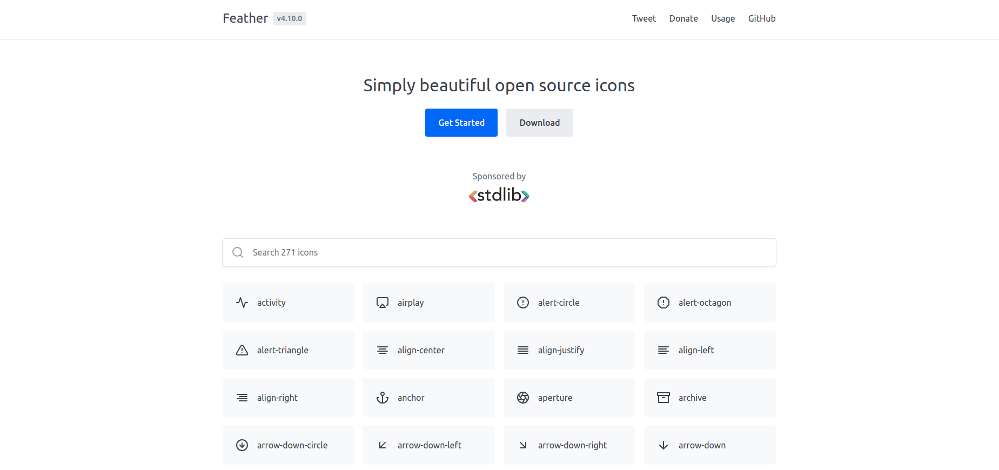

# design-heaven :metal:
Stunning open source design resources every designer/developer should know :nail_care:
 
 ## Icon Libraries
 
 No end of beautiful **SVG** and **web font** icons that can be included to your next project :boom:

- [Feather icons](https://feathericons.com/)
   
   Feather is a collection of simply beautiful open source icons. Each icon is designed on a 24x24 grid with an emphasis on simplicity, consistency and readability.

- [Eva Icons](https://akveo.github.io/eva-icons/#/)

   <!--  -->
   Eva Icons is a pack of more than 480 beautifully crafted Open Source icons for common actions and items.
   
- [Ionicons](https://ionicons.com/)

   Premium designed icons for use in web, iOS, Android, and desktop apps. Support for SVG and web font. Completely open source, MIT licensed and built by the Ionic Framework team.

- [Material Design icons](https://materialdesignicons.com/)

   Material Design Icons' growing icon collection allows designers and developers targeting various platforms to download icons in the format, color and size they need for any project.

- [Font Awesome](https://fontawesome.com/)

   Get vector icons and social logos on your website with Font Awesome, the web's most popular icon set and toolkit.
